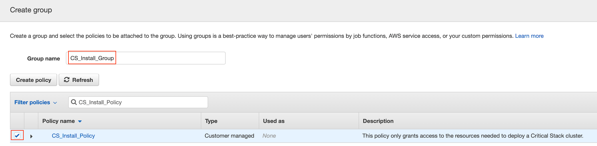
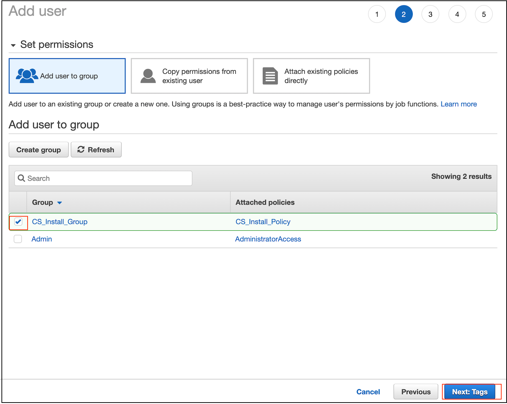

## AWS Account Creation


1.  Go to [AWS](aws.amazon.com) and register for a new free account.

	
	
1.  Sign up for a new account:

	

1.  Fill our your information including **Payment Information** so that Amazon can verify your identity.

1.  Verify your account:

	
	
1.  Sign in to your account:

	
	

## Manage User Access 

1.  From the **AWS Management Console** -> **Find Services** search for `IAM` (Manage User Access and Encryption Key).

	


1. Click **Policies** from the Navigation.

1.  It is recommended that you create a new limited access policy rather than giving a user `admin` access.  For the purpose of the Critical Stack install we will create a new **policy** with only the permissions needed to build the cluster.  Click **Create policy** .

	
	

1.  In the new **Create policy** window you can create a new policy with the Visual editor or with JSON (JavaScript Object Notation).  Select **JSON**

	
	

1.  You can use use this [sample json policy definition](./cs_minimum_policy_install.json) or copy the text below within the JSON editor window.

	```json
	{
    "Version": "2012-10-17",
    "Statement": [
        {
            "Sid": "VisualEditor0",
            "Effect": "Allow",
            "Action": [
                "ec2:AuthorizeSecurityGroupIngress",
                "ec2:DescribeInstances",
                "autoscaling:DescribePolicies",
                "ec2:CreateKeyPair",
                "elasticloadbalancing:CreateLBCookieStickinessPolicy",
                "ec2:AttachInternetGateway",
                "ec2:DescribeSnapshots",
                "ec2:ReportInstanceStatus",
                "iam:AddRoleToInstanceProfile",
                "ec2:DeleteRouteTable",
                "ec2:DescribeVolumeStatus",
                "ec2:StartInstances",
                "ec2:CreateRoute",
                "ec2:CreateInternetGateway",
                "ec2:DescribeVolumes",
                "ec2:DeleteInternetGateway",
                "ec2:DescribeKeyPairs",
                "iam:ListRolePolicies",
                "autoscaling:TerminateInstanceInAutoScalingGroup",
                "autoscaling:DeleteTags",
                "iam:ListPolicies",
                "iam:GetRole",
                "elasticloadbalancing:SetLoadBalancerPoliciesForBackendServer",
                "iam:GetPolicy",
                "ec2:CreateTags",
                "ec2:ModifyNetworkInterfaceAttribute",
                "iam:ListEntitiesForPolicy",
                "ec2:RunInstances",
                "iam:DeleteRole",
                "autoscaling:DescribeLoadBalancers",
                "ec2:StopInstances",
                "ec2:DisassociateRouteTable",
                "ec2:CreateVolume",
                "ec2:CreateNetworkInterface",
                "autoscaling:AttachInstances",
                "ec2:DisassociateIamInstanceProfile",
                "elasticloadbalancing:AddTags",
                "ec2:DescribeImageAttribute",
                "elasticloadbalancing:DeleteLoadBalancerListeners",
                "ec2:DeleteNatGateway",
                "autoscaling:DeleteAutoScalingGroup",
                "ec2:CreateSubnet",
                "ec2:DescribeSubnets",
                "elasticloadbalancing:ModifyLoadBalancerAttributes",
                "iam:GetRolePolicy",
                "autoscaling:DetachInstances",
                "ec2:AttachVolume",
                "ec2:DisassociateAddress",
                "iam:CreateInstanceProfile",
                "autoscaling:DescribeAutoScalingInstances",
                "ec2:CreateNatGateway",
                "ec2:CreateVpc",
                "ec2:ModifyImageAttribute",
                "ec2:ModifySubnetAttribute",
                "iam:ListInstanceProfilesForRole",
                "iam:PassRole",
                "autoscaling:DescribeScalingActivities",
                "ec2:DescribeAvailabilityZones",
                "ec2:DescribeNetworkInterfaceAttribute",
                "iam:DeleteRolePolicy",
                "ec2:CreateSnapshot",
                "elasticloadbalancing:CreateAppCookieStickinessPolicy",
                "autoscaling:DescribeLoadBalancerTargetGroups",
                "elasticloadbalancing:CreateLoadBalancerPolicy",
                "ec2:DeleteNetworkAcl",
                "ec2:DescribeInstanceStatus",
                "ec2:ReleaseAddress",
                "iam:DeleteInstanceProfile",
                "elasticloadbalancing:CreateLoadBalancer",
                "s3:*",
                "ec2:ModifyFpgaImageAttribute",
                "iam:ListRoles",
                "ec2:DisassociateSubnetCidrBlock",
                "ec2:DescribeSecurityGroups",
                "autoscaling:CreateLaunchConfiguration",
                "iam:CreatePolicy",
                "ec2:DescribeFpgaImages",
                "iam:CreateServiceLinkedRole",
                "elasticloadbalancing:SetLoadBalancerPoliciesOfListener",
                "ec2:DescribeVpcs",
                "elasticloadbalancing:EnableAvailabilityZonesForLoadBalancer",
                "autoscaling:DescribeAutoScalingNotificationTypes",
                "iam:GetPolicyVersion",
                "elasticloadbalancing:DetachLoadBalancerFromSubnets",
                "ec2:DeleteSubnet",
                "ec2:MonitorInstances",
                "elasticloadbalancing:DescribeLoadBalancerPolicyTypes",
                "iam:RemoveRoleFromInstanceProfile",
                "iam:CreateRole",
                "ec2:CopyImage",
                "iam:AttachRolePolicy",
                "ec2:AssociateRouteTable",
                "elasticloadbalancing:DeleteLoadBalancer",
                "ec2:DescribeInternetGateways",
                "elasticloadbalancing:DeleteLoadBalancerPolicy",
                "elasticloadbalancing:DescribeLoadBalancers",
                "ec2:DeleteVolume",
                "iam:DetachRolePolicy",
                "autoscaling:DescribeAutoScalingGroups",
                "iam:ListAttachedRolePolicies",
                "elasticloadbalancing:DescribeLoadBalancerPolicies",
                "autoscaling:UpdateAutoScalingGroup",
                "ec2:DescribeAccountAttributes",
                "elasticloadbalancing:DescribeInstanceHealth",
                "elasticloadbalancing:DeregisterInstancesFromLoadBalancer",
                "elasticloadbalancing:RegisterInstancesWithLoadBalancer",
                "ec2:DescribeNetworkAcls",
                "ec2:DescribeRouteTables",
                "elasticloadbalancing:DisableAvailabilityZonesForLoadBalancer",
                "ec2:DetachVolume",
                "autoscaling:SetDesiredCapacity",
                "autoscaling:DescribeTags",
                "ec2:CreateRouteTable",
                "ec2:DeleteNetworkInterface",
                "autoscaling:DetachLoadBalancerTargetGroups",
                "ec2:DetachInternetGateway",
                "autoscaling:AttachLoadBalancerTargetGroups",
                "elasticloadbalancing:DescribeLoadBalancerAttributes",
                "autoscaling:CreateOrUpdateTags",
                "iam:DeleteServiceLinkedRole",
                "ec2:DeleteVpc",
                "ec2:AssociateAddress",
                "autoscaling:CreateAutoScalingGroup",
                "ec2:DeleteKeyPair",
                "ec2:DescribeAddresses",
                "ec2:DeleteSnapshot",
                "ec2:DeleteTags",
                "elasticloadbalancing:ConfigureHealthCheck",
                "ec2:DescribeInstanceAttribute",
                "autoscaling:DescribeLaunchConfigurations",
                "iam:DeletePolicy",
                "elasticloadbalancing:SetLoadBalancerListenerSSLCertificate",
                "elasticloadbalancing:RemoveTags",
                "ec2:DescribeNetworkInterfaces",
                "ec2:CreateSecurityGroup",
                "ec2:CreateNetworkAcl",
                "elasticloadbalancing:ApplySecurityGroupsToLoadBalancer",
                "ec2:ModifyVpcAttribute",
                "autoscaling:SetInstanceHealth",
                "ec2:ModifyInstanceAttribute",
                "iam:CreatePolicyVersion",
                "autoscaling:AttachLoadBalancers",
                "autoscaling:DetachLoadBalancers",
                "elasticloadbalancing:AttachLoadBalancerToSubnets",
                "ec2:TerminateInstances",
                "ec2:DetachNetworkInterface",
                "iam:GetInstanceProfile",
                "elasticloadbalancing:DescribeTags",
                "ec2:DescribeTags",
                "ec2:DeleteRoute",
                "ec2:DescribeNatGateways",
                "iam:ListInstanceProfiles",
                "elasticloadbalancing:CreateLoadBalancerListeners",
                "ec2:AllocateAddress",
                "ec2:DescribeImages",
                "iam:ListPolicyVersions",
                "autoscaling:DeleteLaunchConfiguration",
                "ec2:DeleteSecurityGroup",
                "ec2:AttachNetworkInterface",
                "sts:GetCallerIdentity",
                "ec2:AssociateIamInstanceProfile",
                "iam:DeletePolicyVersion"
           	 ],
           	 "Resource": "*"
       	 }
    	]
	}
	```
1.  Your policy should look similar like this:

	
	
1.  Select **Review Policy**.
2.  Give your policy a name and description and select **Create policy**.

	

	
1. Click **Users** from the Navigation and **Add user**.

	

1.  Select `Programmatic access` for the **Access Type** and Click on **Next: Permission** at the bottom of the page.

	
	


1.  Create a new group for permissions by selecting **Create group**.

	


 

1. Click **Refresh** and search for the policy you just created `CS_Install_Policy`. Click the checkbox by the policy name and give your group a name.  Select **Create Group**.

	
	
1. With group selected click **Next: Tags** from the Add user screen.

	

1. Add any optional tags and select **Next: Review**.

1. Select **Create user** to finalize to user creation.

1. The `Access key ID` and `Secret access key` will be used for the CS Installer.  

	


		

	
	
	